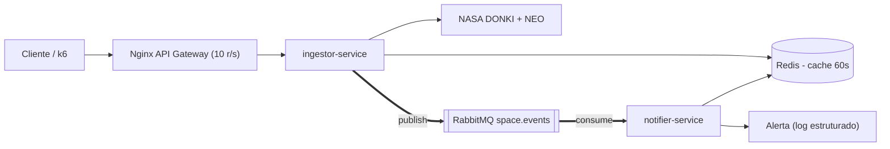

# Solar Shield — Microsserviços de Clima Espacial

Sistema de microsserviços (Node.js) que ingere dados reais da NASA (DONKI/NEO),
classifica riscos de clima espacial por severidade e dispara alertas para
operadores de infraestrutura crítica.

## Integrantes
- Nome 1 — responsável: ingestor + Nginx
- Nome 2 — responsável: notifier + idempotência
- Nome 3 — responsável: testes + k6 + docker-compose

## Visão geral
O `ingestor-service` consulta a NASA DONKI (tempestades geomagnéticas) e NEO
(asteroides), classifica os eventos pelas regras de negócio (RN1/RN2) e publica
no RabbitMQ. O `notifier-service` consome a fila, garante idempotência por
`event_id` (RN3) e dispara o alerta (log estruturado). O Nginx atua como API
Gateway único, com rate limiting.

## Arquitetura



## Regras de negócio
- **RN1** — Severidade por índice Kp: `Kp ≤ 4` → `low` | `5 ≤ Kp ≤ 7` → `moderate`
  | `Kp ≥ 8` → `severe` (com `emergencyNotification = true`). Quando o evento vem
  sem `kpIndex`, usa-se o maior valor de `allKpIndex[].kpIndex`.
- **RN2** — Para eventos `severe`, agrega ao payload publicado a contagem de
  asteroides com `is_potentially_hazardous_asteroid = true` na janela de ±1 dia
  (NEO Feed).
- **RN3** — Idempotência: o `notifier-service` usa o `event_id` real da DONKI
  (`gstID`) propagado via header `x-event-id` e um `SET key NX EX 86400` atômico
  no Redis. Se a chave já existir, a mensagem é confirmada (`ack`) e descartada,
  com log de duplicata — mesmo que o broker reentregue a mensagem.

## Justificativa do TTL do cache
O endpoint `GET /api/space-weather/current` usa **TTL de 60 segundos**. A NASA
DONKI publica notificações de tempestade geomagnética com granularidade de
minutos, e o índice Kp é medido em janelas de 3 horas — portanto um cache de 1
minuto absorve picos de tráfego sem perda relevante de frescor, e ajuda a não
estourar o rate limit do `api.nasa.gov` (30 req/h sem chave própria, 1000 req/h
com chave cadastrada).

## Como rodar

```bash
cp .env.example .env   # edite NASA_API_KEY se tiver uma chave própria
docker compose up --build
```

Serviços expostos:
- API Gateway → http://localhost:8080
- RabbitMQ Management UI → http://localhost:15672 (guest/guest)

## Endpoints (via Nginx, porta 8080)

| Método | Rota                              | Descrição                                  |
|--------|-----------------------------------|--------------------------------------------|
| GET    | `/api/space-weather/current`      | Estado atual (Kp + classificação, cacheado)|
| POST   | `/api/space-weather/ingest`       | Dispara ingestão NASA → classifica → publica|
| GET    | `/api/neo/feed?date=YYYY-MM-DD`   | NEOs do dia (sem cache)                    |
| GET    | `/health`                         | Health check (sem rate limit)              |

### Demonstrando o cache (HIT/MISS)
```bash
curl -i http://localhost:8080/api/space-weather/current   # primeira: X-Cache: MISS
curl -i http://localhost:8080/api/space-weather/current   # seguintes (< 60s): X-Cache: HIT
```

### Demonstrando o rate limiting (429)
```bash
for i in $(seq 1 50); do
  curl -s -o /dev/null -w "%{http_code}\n" http://localhost:8080/api/space-weather/current
done
```
Após estourar o burst (20), as respostas seguintes retornam `429`.

### Demonstrando idempotência (RN3)
1. `POST /api/space-weather/ingest` — publica um evento com `event_id` = `gstID`.
2. Republique manualmente a mesma mensagem na fila `notifier.alerts` (ou reinicie
   o `notifier`) — o log mostrará `duplicado, ignorando event_id=...` e o alerta
   **não** será reenviado.

## Testes

```bash
npm install
npm test
```

Cobrem:
- `tests/rn1.classify.test.js` — RN1 (fronteiras de Kp: 0, 4, 5, 7, 8, 9 e
  extração de `allKpIndex`)
- `tests/rn3.idempotency.test.js` — RN3 (mesmo `event_id` é notificado uma
  única vez)
- `tests/donki.parsing.test.js` — parsing de payload DONKI real (extração do
  maior Kp e classificação combinadas)

## Smoke test (k6)

```bash
docker run --rm --network host -i grafana/k6 run - < k6/smoke.js | tee k6/result.txt
```

10 VUs / 10s contra `GET /api/space-weather/current`, validando status 200 e
presença do campo `classification`.

## Resiliência (retry/backoff)
O cliente NASA (`src/ingestor-service/src/nasaClient.js`) usa `axios` +
`axios-retry`: timeout de 5s, 3 tentativas com backoff exponencial
(500ms, 1s, 2s), retry apenas em erros transitórios (timeout, 5xx, 429); erros
4xx são propagados imediatamente. Cada tentativa é logada com a URL e o motivo.

        
## Estrutura de pastas

```
solar-shield/
├── README.md
├── docker-compose.yml
├── nginx.conf
├── .env.example
├── package.json            # testes unitários (raiz)
├── src/
│   ├── ingestor-service/   # consome NASA, classifica (RN1/RN2), publica no RabbitMQ
│   └── notifier-service/   # consome a fila, aplica RN3, dispara alerta
├── tests/                  # 3 testes unitários (RN1, RN3, parsing)
└── k6/                     # smoke test (10 VUs / 10s)
```


